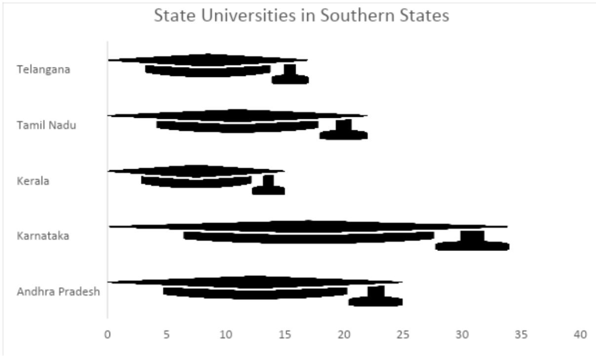
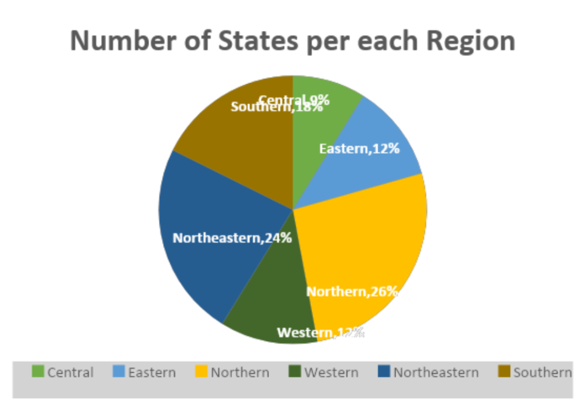
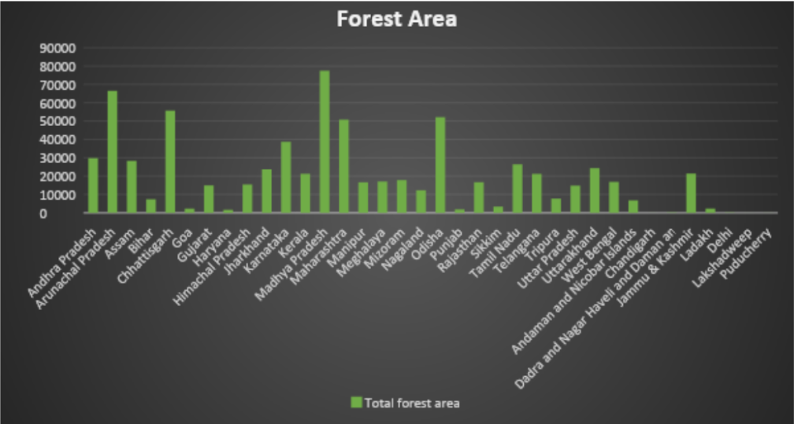
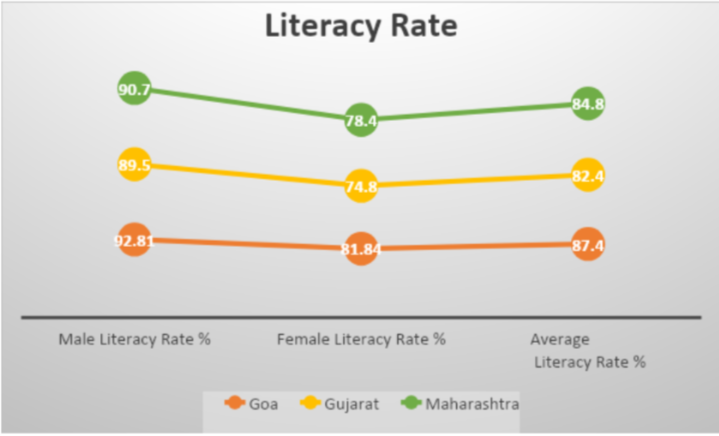
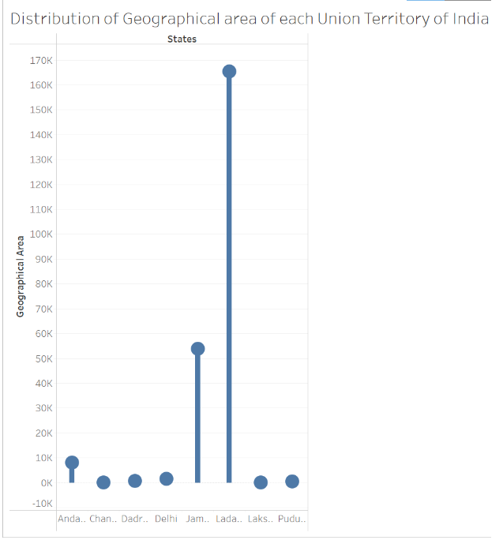
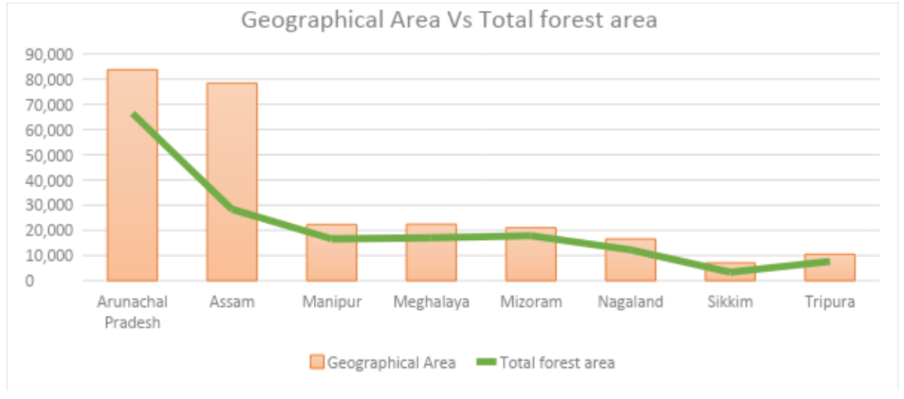

# Data Visualization Of Indian StatesAnalysis

**Introduction:** The chosen data for the project** provides information about each state and union territory of India. This information includes the State name along with its vehicle code, capital, region, number of districts, number of state universities, geographical area, national share (%) of the state region, total forest area, percentage of forested area covered, male literacy rate, female literacy rate, the average literacy rate, total population and numbers of Aadhaar assigned. All this information is based on the census collected by Indian government in the year 2020. All the information related to 28 states and 8 Union territories.

**Domain of the data set:** All the data provided in the Excel file has been collected from various Wikipedia pages. All the information about each state was published by Indian government at a certain point. The data provided in columns like geographical area total forest area, male literacy rate, female literacy rate, the average literacy rate, total population and numbers of Aadhaar assigned was published by the Indian government depending upon the Census of 2020.

**Data file:**
[IndiaStatewise.xlsx](https://github.com/SaiKundanaSakhamuri/DataVisualizationOfIndianStatesAnalysis/blob/main/IndiaStatewise.xlsx)

**Data source:**

[**https://en.wikipedia.org/wiki/List_of_state_and_union_territory_capitals_in_India](https://en.wikipedia.org/wiki/List_of_state_and_union_territory_capitals_in_India)** 

[**https://en.wikipedia.org/wiki/List_of_districts_in_India**](https://en.wikipedia.org/wiki/List_of_districts_in_India)

[**https://en.wikipedia.org/wiki/Forest_cover_by_state_in_India#Forest_cover**](https://en.wikipedia.org/wiki/Forest_cover_by_state_in_India%23Forest_cover)

**Number of records and columns:**

Number of records – 37

Each record represents a state or union territory of India.

Number of columns – 14

Each column provides data about each state.

**Visualization tools selected:** Microsoft Excel and Tableau Desktop

**Goal 1**: To find the states in Southern part with more than 25 universities

**Pictogram:**

**Story:**

The above Pictogram describes the information about the number of state universities present in each state that is in the Southern part of India. There are two states among the Southern states with more than 25 universities. One of them is Karnataka with 34 universities and Andhra Pradesh with 25 universities. There are a total of five states in the Southern part of India, those are Telangana, Tamil Nadu, Kerala, Karnataka and Andhra Pradesh. While Karnataka has highest number of universities, Kerala has least number of universities with count of 15 followed by Telangana with a count of 17.

**Goal 2**: To find out which region of India has the most number of states under it.

**Pie Chart:**

**Story:** As the above pie chart depicts 26% of the states come under the Northern region. A total of 9 states are in the Northern part of India. Then comes the Northeastern states. This region comprises eight states – Arunachal Pradesh, Assam, Manipur, Meghalaya, Mizoram, Nagaland, Tripura and Sikkim. Whereas the central part of India covers only 3 states. They combine to cover a total of 684,372 km². Southern region has twice the number of states of Central region.

**Goal 3:** To analyze the distribution of forest lands state-wise in India

**Bar Chart:**

**Story:** The above bar graph helps us to depict the information about the forest land distributed geographically across the states and union territories of India. India is known to be one of the ten most forest-rich countries of the world. As of 2021, the total forest cover in India is 713,789 Sq km, which is 21.71 percent of the total geographical area.  Madhya Pradesh has the highest forest cover as per the area followed by the Arunachal Pradesh. Mizoram has the highest forest cover in terms of percentage of total geographical area.

**Goal 4:** To find out which state among the Goa, Gujarat and Maharashtra have highest male and female literacy rate.

**Bump Chart:**

**Story:** The above slope graph depicts** the male literacy rate, female literacy rate and the average literacy rate among three states - Goa, Gujarat and Maharashtra. As it is shown Goa stands at the top in all three categories. The population of Goa is 15,86,250. Among which 87.4 percent of total literacy is achieved. When it comes to female literacy rate, it falls behind when compared to male literacy rate by almost 10 percent.

**Goal 5:** To identify the union territory with largest geographical area

**Lollipop chart**

**Story:** The above Lollipop chart can help us to identify the largest dense area state amongst the union territories. In total there are eight union territories – Andaman and Nicobar Islands, Dadra and Nagar Haveli and Daman and Diu, Chandigarh, Lakshadweep, Puducherry, Delhi, Ladakh, Jammu and Kashmir. Ladakh is the largest union territory in India in terms of area with 168055 sq km. Population-wise, the largest union territory is Delhi. Whereas Sikkim stands last with least area as well in the population.

**Goal 6:** To analyze the difference in the total geographical area occupied by the Northeastern states and the forest area they cover.

**Combo Chart**

**Story:** The above Combo chart helps us to get a proper overview of the geographical area and the forest area covered by the Northeastern states. The eight sister states have a total forest cover of 1,69,521 square km, out of their total geographical area of 2,62,179 sq km, which is 7.98 per cent of the country's geographical area. Mizoram stands at the top with 85.41% of its total area covered with forest.

**Conclusion:**

All the above charts depict data about state and union territory of India. India has 28 states and 8 Union territories with total of 773 districts. As per 2020 census, the total forest 80.9 million hectares, which is 24.62% of the geographical area of the country. The literacy rate in the country is 74.04 per cent, 82.14 for males and 65.46 for females. Kerala stands on top with a 96.2 per cent literacy rate. India ranks number 2 in the list of countries by population with density of 464 per sq km in 2020.

